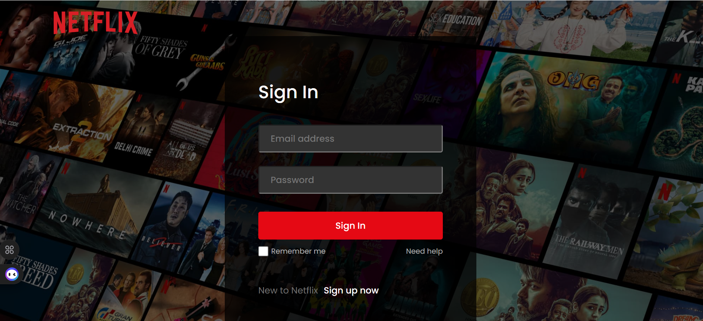
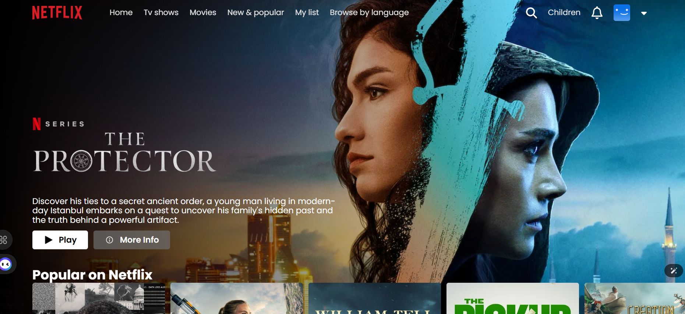
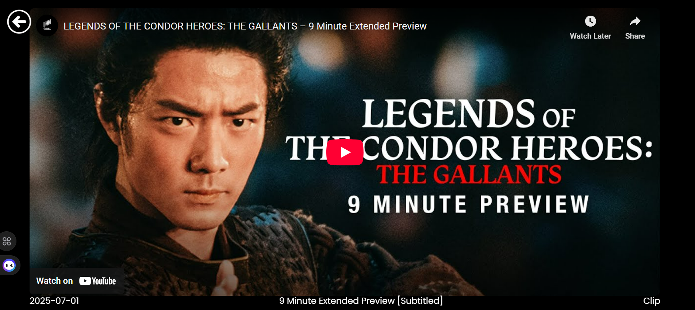

# 🎬 Netflix Clone

A Netflix-inspired web application built with **React**, **Firebase Authentication**, and the **TMDB API**.
Users can sign up or sign in and click on any movie to watch its trailer — all in a modern, responsive Netflix-style UI.

---

## 🚀 Features

- **User Authentication** – Sign up and log in using Firebase Authentication.
- **Responsive Netflix UI** – Identical to Netflix's interface with hero banners, title cards, and hover effects.
- **Movie Data from TMDB** – Dynamic movie categories such as Popular, Top Rated, and Upcoming.
- **Trailer Playback** – Click a movie poster to watch its trailer directly in the app.
- **Responsive Design** – Optimized for desktop, tablet, and mobile screens.
- **Gradient Banner Effects** – Smooth image masking for an authentic Netflix look.

---

## 🛠️ Tech Stack

- **Frontend:** React, CSS, JavaScript
- **Authentication:** Firebase Authentication
- **Database:** Firestore (for storing user details)
- **API:** The Movie Database (TMDB API)
- **Hosting:** Firebase Hosting (optional if deployed)

---

## 📷 Screenshots

| Sign In Page                                    | Home Page                                  | Movie Trailer                                    |
| ----------------------------------------------- | ------------------------------------------ | ------------------------------------------------ |
|  |  |  |

---

## 📚 API Reference

- **TMDB API Documentation:** [https://developers.themoviedb.org]()
- **Firebase Documentation:** [https://firebase.google.com/docs]()

## ⚙️ Installation

1. Clone the repository

```bash
git clone https://github.com/Edeghoghon/netflix-clone.git
```

2. Navigate into the project directory

   cd netflix-clone

3. Install dependencies (npm install )
